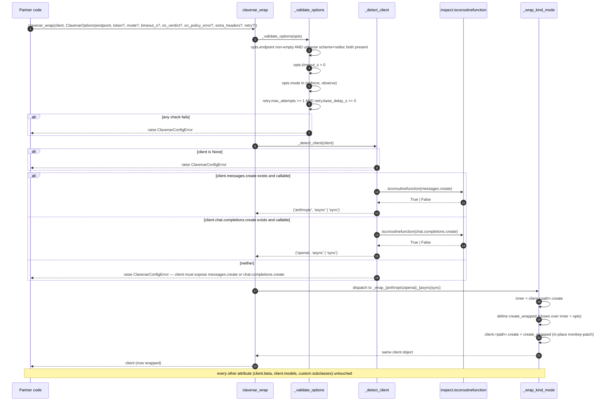
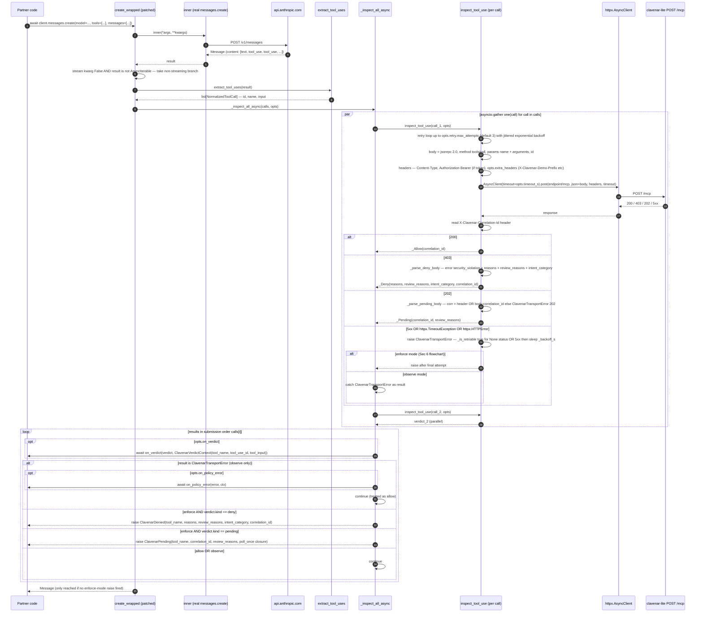
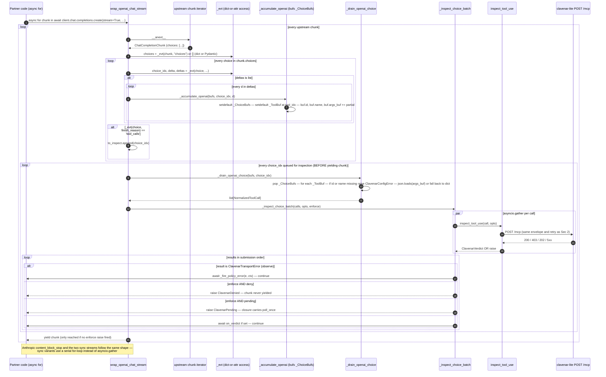
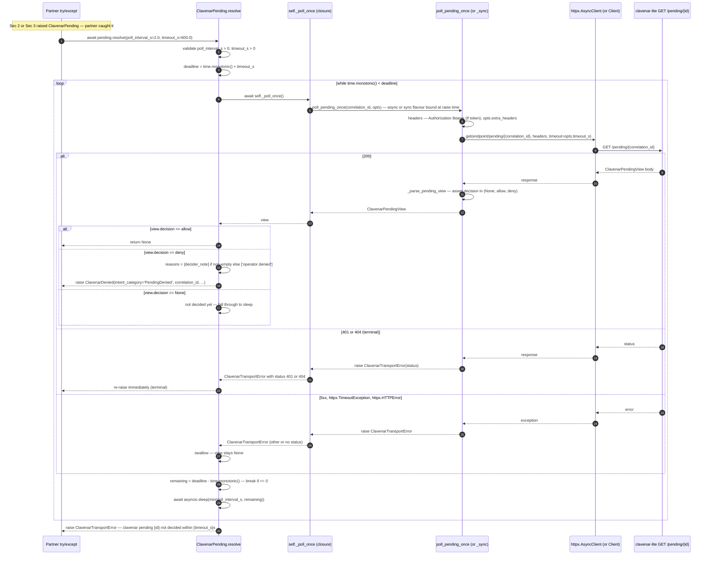
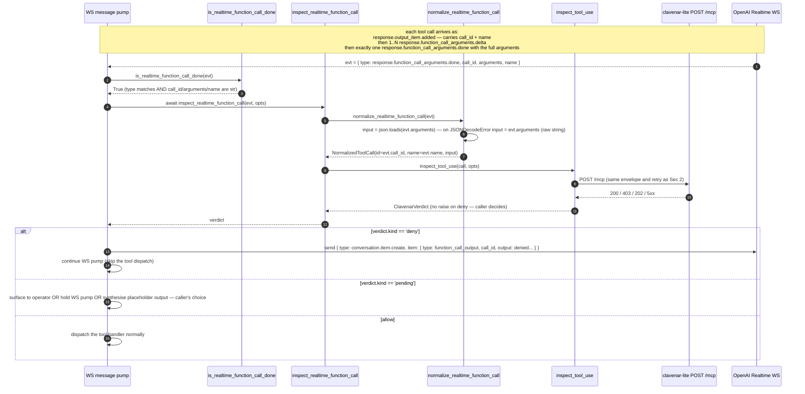
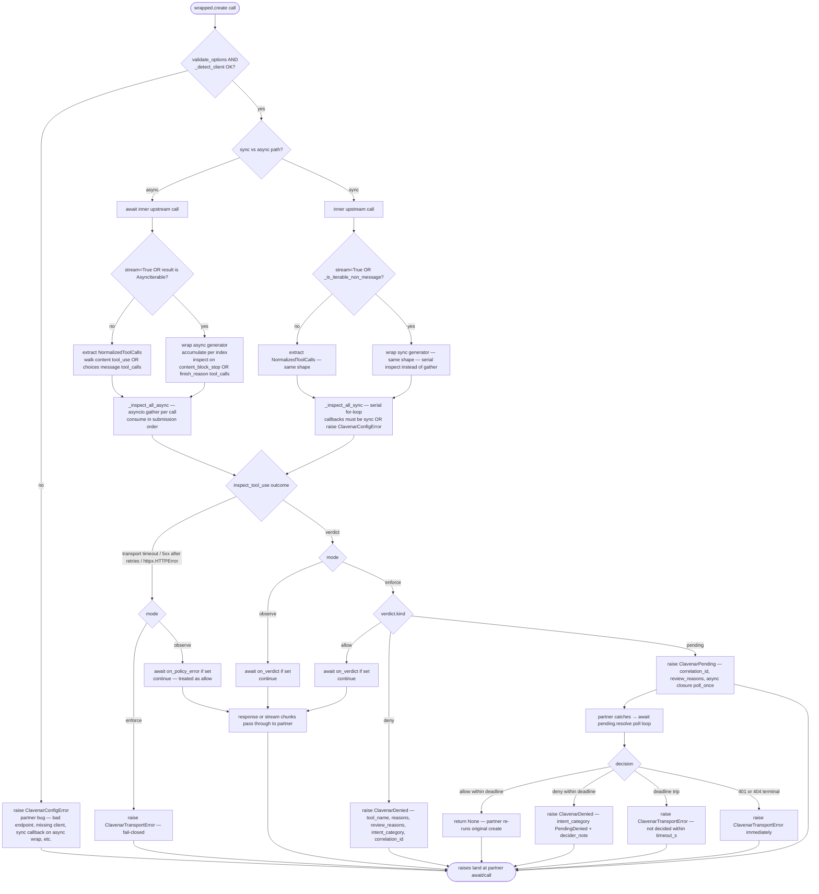

# clavenar-ai (Python) sequence diagrams

Five sequence diagrams covering the wire-level paths the Python SDK
can take: `clavenar_wrap` boot with the structural client + sync/async
fork, the async non-streaming inspection (Anthropic shown; OpenAI
Chat parallels), the async OpenAI Chat streaming choice-end gate
(Anthropic `content_block_stop` and the sync streams parallel),
`ClavenarPending.resolve` polling until decided, and the standalone
`inspect_realtime_function_call` helper for the OpenAI Realtime WS
surface. A request decision-tree flowchart closes the file.

The SDK is a faithful client of the same wire contract as the TS
sibling at [`clavenar-typescript-sdk`](https://github.com/clavenar/clavenar-typescript-sdk).
The diagrams emphasise the Python-specific shape (in-place
`.create` monkey-patch instead of a `Proxy` facade,
`inspect.iscoroutinefunction`-driven sync/async detection,
`httpx.AsyncClient` / `httpx.Client`, `asyncio.gather` vs a serial
sync loop, and the dual dict/attribute event access for
Pydantic-vs-raw streams).

## 1. `clavenar_wrap` — validate, detect, monkey-patch the right `.create`

`clavenar_wrap` runs once per client. It validates the option bag,
detects the client by `messages.create` (Anthropic) or
`chat.completions.create` (OpenAI), inspects that method with
`inspect.iscoroutinefunction` to pick the sync vs async path, then
monkey-patches `.create` in place. Python's attribute model doesn't
have a clean `Proxy` equivalent, so the in-place patch is the
cleanest seam — partners typically pass the wrapped client by
reference into LangChain / LlamaIndex / their own framework.

## 2. Async non-streaming inspection — `asyncio.gather` parallel, submission-order raise

When the partner `await`s `client.messages.create(...)`, the patched
`create_wrapped` calls upstream, walks `content[]` for `tool_use`
blocks via `extract_tool_uses`, and runs `_inspect_all_async`. That
helper fans every call out concurrently via `asyncio.gather` over
`inspect_tool_use`, then consumes results in submission order so two
parallel denies always produce the same `ClavenarDenied.tool_name`
deterministically. The same pipeline applies to OpenAI Chat
(`extract_tool_calls` over `choices[].message.tool_calls`).

## 3. Async OpenAI Chat streaming — hold `finish_reason='tool_calls'` until inspection clears

`wrap_openai_chat_stream` is an async generator that yields upstream
chunks one-for-one. Tool deltas are accumulated per
`(choice_index, tool_index)` keyed against a `_ChoiceBufs` dict.
When a chunk's `choice.finish_reason == 'tool_calls'` arrives,
`_drain_openai_choice` materialises every accumulated call,
`_inspect_choice_batch` runs them concurrently via `asyncio.gather`,
verdicts are processed, and *only then* is the chunk yielded — so a
denied call raises before the partner ever sees the closing chunk.
The Anthropic stream wrap (`content_block_stop` per index) and both
sync stream wrappers follow the same pattern; only the
gather-vs-serial detail differs.

## 4. `ClavenarPending.resolve` — poll until decided, terminal vs transient errors

When enforce mode raises `ClavenarPending`, the partner catches it,
runs whatever side-work fits during the wait, then `await
pending.resolve(...)`. The loop polls
`GET /pending/{correlation_id}` every `poll_interval_s` (default 2s)
until the operator decides or the `time.monotonic()` deadline trips
at `timeout_s` (default 600s). Terminal transport failures (401,
404) re-raise immediately; everything else (5xx, network blips,
None view) is swallowed and the loop continues.

## 5. OpenAI Realtime — one-shot `inspect_realtime_function_call`

The Realtime API is websocket-based; there is no `client.method()`
for `clavenar_wrap` to intercept. The partner drains the WS event
stream and runs each `response.function_call_arguments.done`
through `inspect_realtime_function_call`, which normalises the
event (parsing the JSON-encoded `arguments` string, falling back to
the raw string on parse failure so clavenar can still inspect the
malformed-args attempt) and runs one `inspect_tool_use`. The helper
returns the verdict — caller decides how to react (return a
synthesised `function_call_output`, hold the pump, surface to
operator).

## 6. Request decision tree (flowchart)

A single `create()` invocation through the wrapped client fans out
across five orthogonal knobs: sync vs async client, response shape
(non-streaming vs streaming), per-call verdict, enforcement mode,
and transport health. The flowchart captures the final outcomes —
pass-through, `ClavenarDenied`, `ClavenarPending`, `ClavenarTransportError`,
or a `ClavenarConfigError` raised before any of those.

